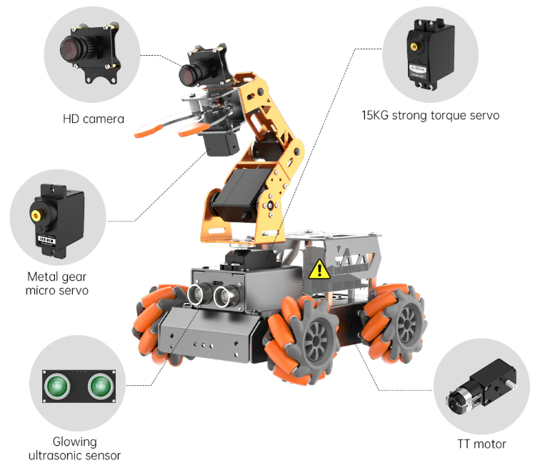

<!-- _class: title -->

<!-- Técnicas e Ferramentas para Modelagem e Análise de Comunicação em Sistemas Ciberfísicos -->

# Modelagem de Sistemas Ciberfísicos com AADL

Ana Barbosa, Wenderson Nascimento

---

## Abstração de Componentes

Na AADL, um componente é caracterizado por seu nome único e suas propiedades especifícias.

As abstrações de componentes são separados em três categorias:

- Software de Aplicação
- Plataforma de Execução (Hardware)
- Composto

---
<!-- _class: style_b -->

## Software de Aplicação

* **Thread**: Uma unidade escalonável de execução concorrente.
* **Thread Group**: Uma unidade composicional para organizar threads.

* **Process**: Um espaço de endereçamento protegido.

* **Data**: tipos de dados e dados estáticos no código-fonte.

* **Subprogram**: Código sequencial executável que pode ser chamado.

---

## Plataforma de Execução

* **Processor**: Componentes que executam _threads_.

* **Memory**: Componentes que armazenam dados e código.

* **Bus**:  Componentes que fornecem acesso entre os componentes da plataforma e execução.

* **Device**: Componentes que fazem interação com o ambiente externo.

---
<!-- _class: style_b -->

## Abstração de Sistema (Composto)
Um sistema composto de software, plataforma de execução, ou componentes de sistemas.

Podem representar sistemas complexos de sistemas, como a intregração de software e hardware de uma aplicação dedicada. Por exemplo, um sistema de vôo ou um banco de dados.

---

## Exemplo de Abstração
<style scoped>img {position: absolute; left: 55%;}</style>



| Componente                        | Categoria AADL |
| --------------------------------- | -------------- |
| CPU _Cortex A72_                  | **Processor** |
| Raspberry Pi                      | **System** |
| Cartão SD                         | **Memory** |
| Motores, Servos                   | **Device** |
| Câmera, Ultrassom                 | **Device** |
| Baterias                          | **Device** |
| Cabos, USB                        | **Bus** |

---
<!-- _class: style_b -->

### Exemplo em Texto AADL

```aadl
bus Cabo end Cabo;

-- Micro servo da Garra
device MicroServo
  features
    bus : requires bus access Cabo;
end MicroServo;
```

> Comentários em AADL `-- comentário em linha`

---
<!-- _class: style_c -->
<style scoped>section { font-size: 20px; }</style>

## Referências

